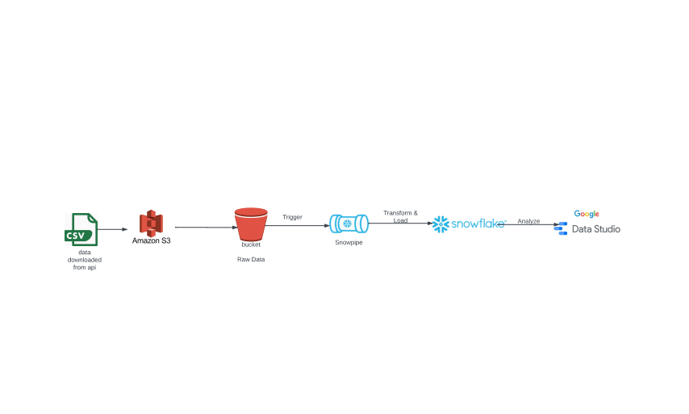

# Motor-Vehicles-Collision-Data-Analysis-NewYork
### Identifying High-Risk Areas based on accident data.

## Workflow/Architecture

## Problem: Identifying High-Risk Areas
For this project I've tried to build a batch pipeline to process motor vehicle collisions data in New York from (`https://catalog.data.gov/`,An official website of the GSA's Technology Transformation Services).The Motor Vehicle Collisions crash table contains details on the crash event. Each row represents a crash event. The Motor Vehicle Collisions data tables contain information from all police reported motor vehicle collisions/accidents in NYC. 
Accidents can occur more frequently in certain neighborhoods or zip codes. Identifying these high-risk areas is crucial for improving safety measures, allocating resources effectively, and preventing accidents. **We want to pinpoint the locations where accidents are most likely to happen.**

## Dataset
[Real Estate dataset website](https://catalog.data.gov/dataset/real-estate-sales-2001-2018/resource/f7cb94d8-283c-476f-a966-cc8c9e1308b4)

[Real Estate dataset direct link](https://data.ct.gov/api/views/5mzw-sjtu/rows.csv?accessType=DOWNLOAD)

## Technologies
- **Amazon Web Services** (AWS):
  - VM Instance to run project on it.
  - Cloud Storage to store processed data.
- **Terraform** to create cloud infrastructure.
- **Docker** for containerization (docker-compose)
- **Python** main programming language
- **Airflow** to run data pipelines as DAGs.
- **Snowflake** data warehouse for the project.
- **Google data studio** to visualize data.

# Reproducing from scratch
## 1. To reproduce this code entirely from scratch, you will need to create a AWS account:
Refer [here](https://github.com/adityachaudhary99/dataengineering-real-estate-analysis-project/blob/main/pre-reqs.md) for AWS setup details

## 2. You'll need your IaC to build your infrastructure. In this project, Terraform is used
Download Terraform!
* Download here: https://www.terraform.io/downloads

Initializing Terraform
* Create a new directory with `main.tf`, and initialize your config file. [Details](https://docs.aws.amazon.com/search/doc-search.html?searchPath=documentation&searchQuery=terraform+aws)
    * *OPTIONAL* Create `variables.tf` files to store your variables
* `terraform init`
* `terraform plan`
* `terraform apply`

## 3. Set up Docker, Dockerfile, and docker-compose to run Airflow

#### Data pipelines
The dataset data download, process and upload to cloud storage, transfer to data warehouse is done via these Airflow DAGs:

**Local to AWS Dag**  
  - Downloads the dataset file in the csv format. This task runs by a bash script, which downloads the data. 
  - Next the data is pre-processed using pyspark(changing column names, data types, etc) and saves it locally in the form of parquet file. 
  - This file is then uploaded to project Cloud Storage(Data Lake).
  - Last task triggers the <code>gcs_to_bq_dag</code> so that it runs right after the data has been loaded to project Cloud Storage.

## 4. Run the DAGs
In the screenshot below:
* run the `local_to_aws_dag` in the airflow UI after setting up airflow. 

## 5. Snowflake
The snowflake environment is setup up using the files [here](https://github.com/adityachaudhary99/dataengineering-real-estate-analysis-project/blob/main/snowflake_scripts).
A snowpipe is configured in snowflake that is triggered by the event notification setup in the project s3 bucket(send notification as soon as a new file is uploaded in the project s3 bucket). This snowpipe transfers the data from the s3 bucket into an external stage in a metadata base in snowflake in the form of table. This table is then used to load the transformed data in the main data warehouse for the project. 

### 6. Create your dashboard
* Go to [Google Data Studio](https://datastudio.google.com) 
* Click `Create` > `Data Source`
* Select `BigQuery` > Your Project ID > Dataset > Table
* Click on `Connect` on the top-right and your data should now be imported to use for your dashboard!

#### Dashboard
Simple dashboard at Google Data studio with few graphs.
- Average Accessed Value by Year.
- Sale Amount vs. Accessed Value.​
- Average Accessed Value Over the Years​.
- Residential Type Distribution.

Below is a screenshot of my [dashboard](https://lookerstudio.google.com/s/raoYn0w6ehQ).

